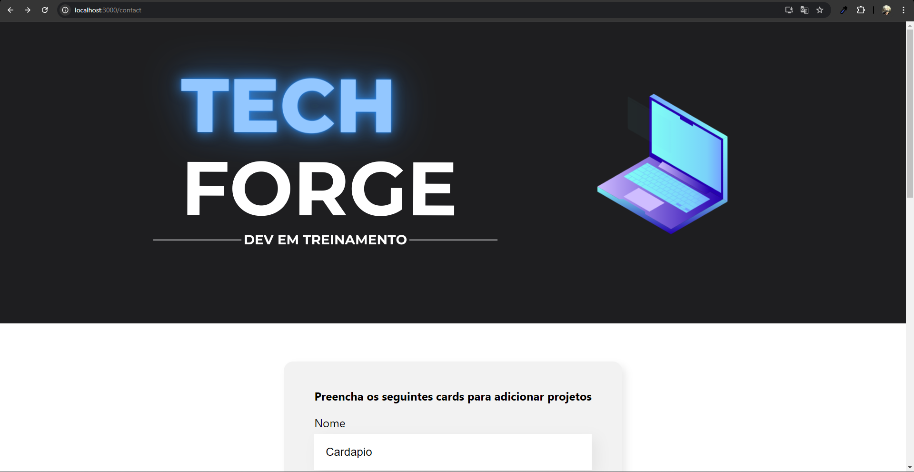
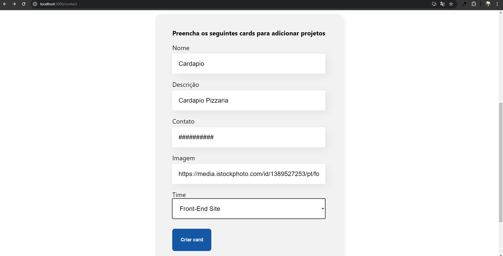
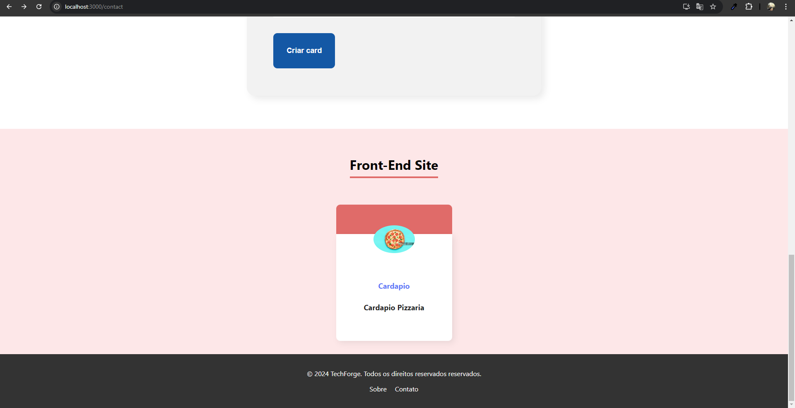

# MiniPortifolio System - React JS

> Sistema de add de projetos BackEnd e FrontEnd





> ## Índice

- [Sobre](#sobre)
- [Clone](#clone)

> ## <a name="sobre"></a> Sobre

- Projeto com o objetivo de simular um sistema de add de projetos.
- Nesse sistema é possível cadastrar possiveis projetos e links de repositorios.
- No intuito de similar um pequeno sistema de controle de portifolio (links).

### <a name="clone"></a>Clone

```
git clone https://github.com/Alexandroni07/miniPortifolio.git
```

### Instalando as dependências

```
npm install
```

### <a name="execucao-dev"></a> Execução do React em ambiente de desenvolvimento

```
npm start
```
